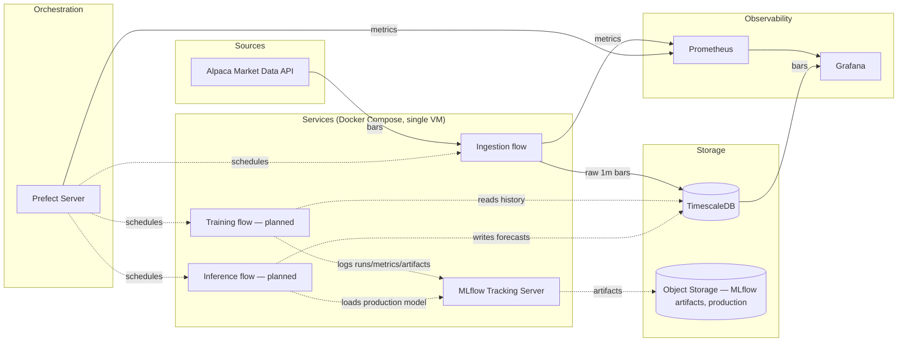

# QuantPipe

Self-hosted infrastructure for periodically ingesting market data, storing it in a
timeseries database, retraining forecasting models, and visualizing both data and
predictions — designed to run on Oracle Cloud's Always Free tier.

## What it does

- Periodically pulls 1-minute price bars for a **configurable list of tickers**
  (stocks and crypto) from **Alpaca**.
- Stores bars in **TimescaleDB**, with automatic rollups to 15m/1h/1d via
  continuous aggregates — no separate ingestion path per timeframe.
- (Planned) Periodically retrains forecasting models per ticker/timeframe,
  tracked in **MLflow**, and promotes to production only when a challenger
  beats the current model on a validation metric.
- (Planned) Periodically computes predictions from the current production
  model and stores them alongside actuals.
- **Observability** via Prometheus (metrics) and Grafana (infra + price/prediction
  dashboards).
- **Orchestration** of all scheduled work via **Prefect**.
- **Infrastructure as code**: Terraform provisions the Oracle Cloud resources;
  Docker Compose runs the services on a single VM.

## System overview



## Current implementation status

| Piece | Status |
|---|---|
| `common/quantpipe_common` (config, schemas, DB models, Alembic migrations) | Built |
| `services/ingestion` (Alpaca client, Prefect flow, tests) | Built |
| `services/prefect_flows` (deployment scheduling) | Built — `ingest-bars` only |
| `services/training`, `services/inference` | **Not built yet** |
| `monitoring/` (Prometheus scrape config, Grafana provisioning + dashboards) | Built |
| `docker-compose.yml` | Built — `training`/`inference` present but commented out |
| `infra/terraform` | Written, **not verified against a real OCI account** (see below) |

The database schema already includes `predictions` and `model_registry` (see
`data-model.md` in the design notes) even though nothing writes to them yet —
it was cheap to create the full schema in one migration pass rather than
extend it twice.

### Deliberate deviations from the original design notes

- **No separate `prefect-worker` container.** `services/prefect_flows/deployments.py`
  uses Prefect's `flow.serve()` API, which self-schedules and executes flow runs
  in the same process — simpler than a work-pool + worker for a single-VM
  deployment with no need for per-run container isolation yet. Revisit if
  training later needs isolated/GPU work-pool execution.
- **Prefect's and MLflow's own metadata use SQLite by default**, not a second
  Postgres database — one less moving part for a solo, single-VM deployment.
  MLflow's artifact store is the local filesystem in dev; production points it
  at Oracle Object Storage instead (see `.env.example`).

## Repository layout

```
quantpipe/
├── infra/terraform/          # VCN/subnet/security list, Ampere A1 instance, Block Volume, Object Storage bucket
├── docker-compose.yml        # timescaledb, prefect-server, mlflow, ingestion-flows, prometheus, grafana, exporters
├── services/
│   ├── ingestion/            # Alpaca client + Prefect flow: fetch -> validate -> upsert bars_1m
│   └── prefect_flows/        # deployments.py: schedules, kept separate from flow logic
├── common/quantpipe_common/  # shared package: config/schemas, SQLAlchemy models, session factory, Alembic migrations
├── monitoring/                # prometheus.yml, Grafana datasource/dashboard provisioning
└── config/tickers.yaml        # user-editable ticker/timeframe list
```

## Local development

Requires Docker + Docker Compose, and Python 3.12 for running things outside
containers (tests, one-off scripts).

1. **Configure secrets**
   ```
   cp .env.example .env
   # fill in ALPACA_API_KEY / ALPACA_SECRET_KEY at minimum
   ```

2. **Set up a local environment** (for tests and running Alembic outside Docker)
   ```
   python3.12 -m venv .venv
   .venv/Scripts/pip install -r requirements-dev.txt -e ./common
   .venv/Scripts/pip install -r services/ingestion/requirements.txt
   ```

3. **Bring up the stack**
   ```
   docker compose up -d --build
   ```
   `docker-compose.override.yml` (applied automatically) exposes TimescaleDB,
   the Prefect UI, MLflow, and Prometheus on `localhost` for local debugging —
   the base file alone only publishes Grafana, matching the production VM.

4. **Run migrations** (against the compose-managed TimescaleDB)
   ```
   cd common
   POSTGRES_USER=quantpipe POSTGRES_PASSWORD=<from .env> POSTGRES_DB=quantpipe \
     POSTGRES_HOST=localhost POSTGRES_PORT=5432 \
     ../.venv/Scripts/python -m alembic upgrade head
   ```

5. **Open things up**: Grafana at `localhost:3000`, Prefect UI at `localhost:4200`,
   MLflow at `localhost:5000`.

6. **Edit `config/tickers.yaml`** to change which tickers/timeframes are tracked —
   it's bind-mounted into `ingestion-flows`, so a container restart (not a
   rebuild) picks up changes.

### Running tests

```
.venv/Scripts/python -m pytest common/tests services/ingestion/tests
```

The ingestion test suite spins up Prefect's ephemeral test harness once per
run (`services/ingestion/tests/conftest.py`) — the first test in a session
costs ~30-60s for that setup; this is expected, not a hang.

## Deploying to Oracle Cloud

1. `cd infra/terraform && cp terraform.tfvars.example terraform.tfvars`, fill
   in your tenancy/compartment OCIDs, API key fingerprint, admin IP, and a
   region-specific ARM image OCID (see `variables.tf` for how to look one up).
2. `terraform init && terraform validate && terraform plan` — review before applying.
   (Not verified against a real OCI account as part of building this scaffold —
   review the plan output carefully before `apply`.)
3. `terraform apply` provisions the VCN, security list (SSH + Grafana only,
   restricted to `admin_ip`), the Ampere A1 instance, its Block Volume, and the
   Object Storage bucket. Cloud-init clones this repo and runs `docker compose up -d`.
4. SSH in and create `.env` on the VM by hand (see `.env.example`) — secrets are
   never part of the Terraform template. Then `docker compose up -d` if it
   didn't already start cleanly.
5. Future deploys: `git pull && docker compose up -d --build` on the VM. Re-running
   Compose never touches Terraform-managed cloud resources.

## Deferred (see the original design notes for detail)

True commodities/futures data, CI/CD, backup/DR automation, secrets management
beyond `.env`, Grafana alerting rules, and any multi-instance/HA setup.
